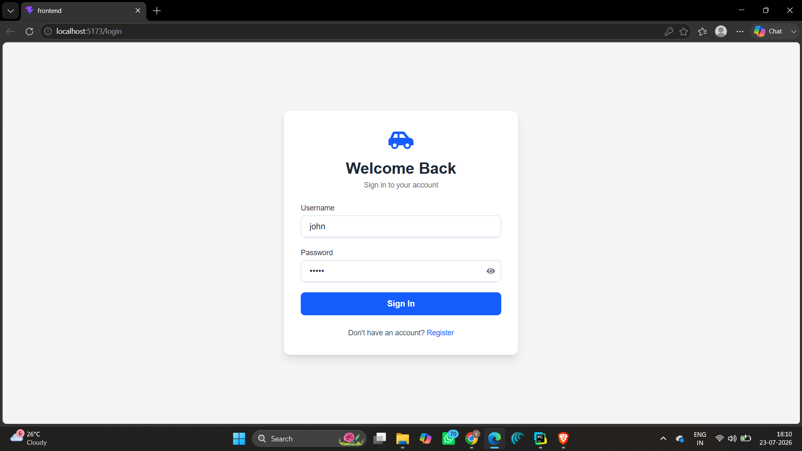
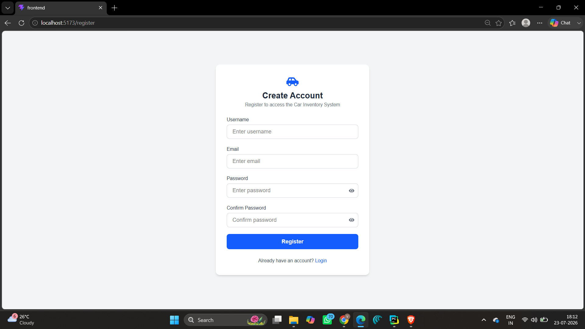
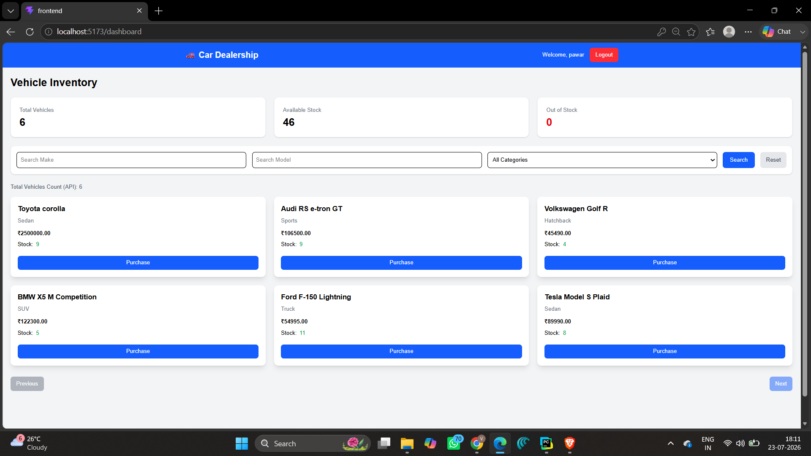
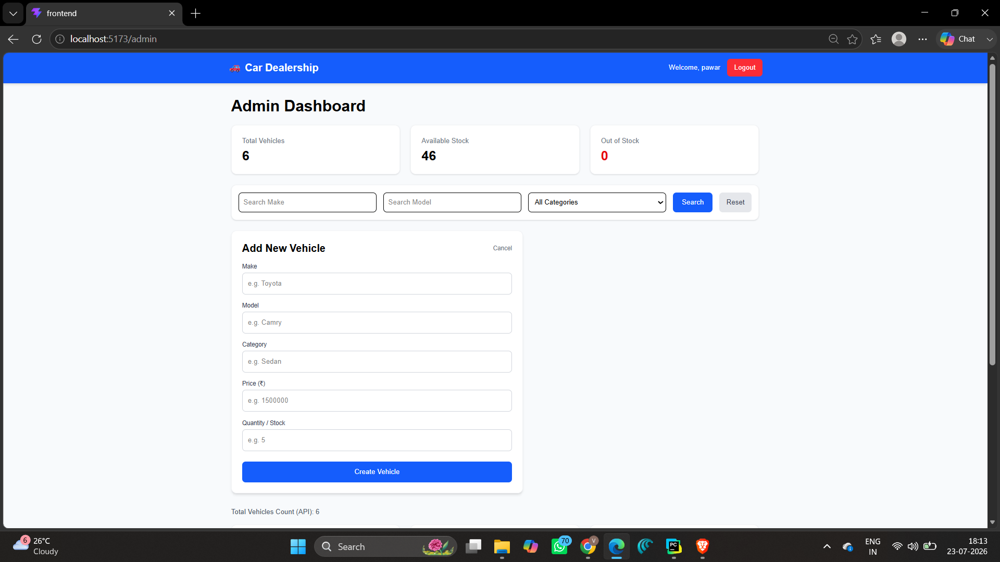
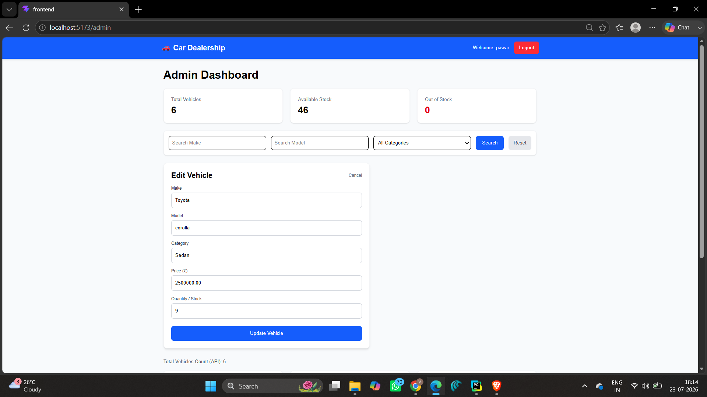
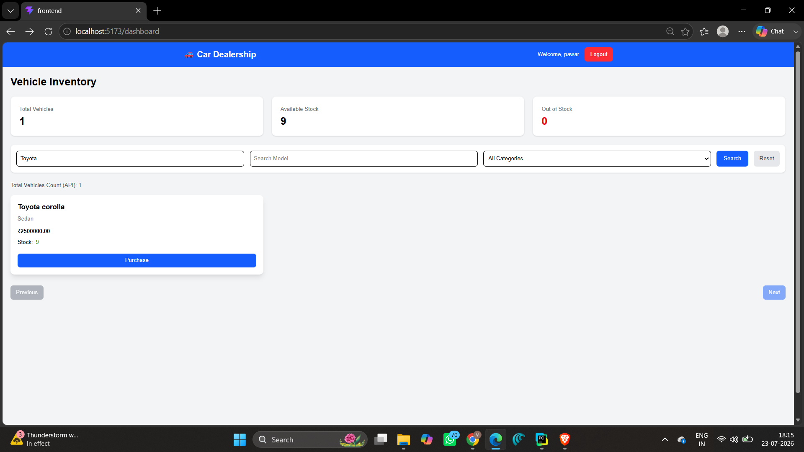
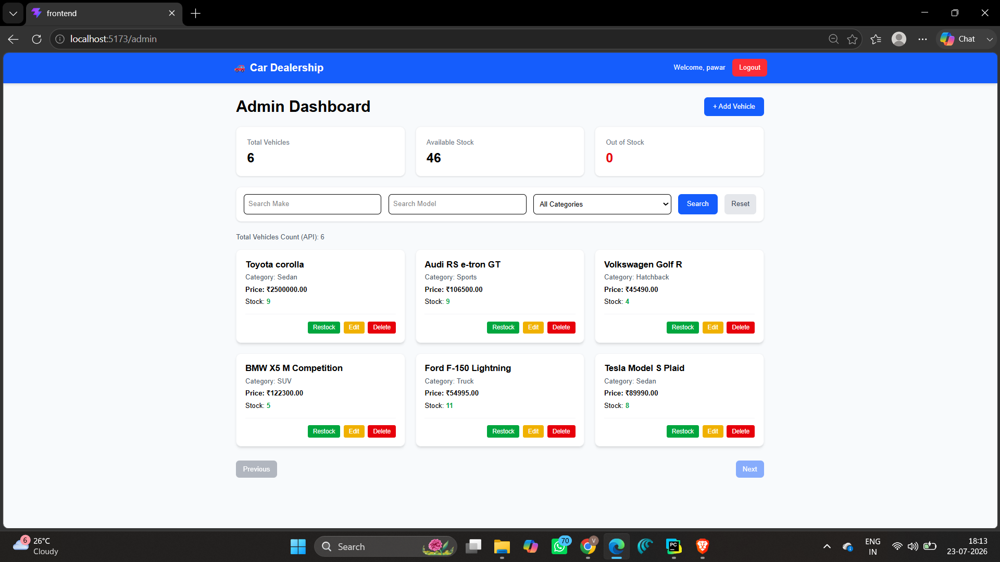

# 🚗 Car Dealership Inventory Management System

<p align="center">
  
  
  
  
  
  
  
</p>

A modern **Full Stack Car Dealership Inventory Management System** built with **React, Django REST Framework, PostgreSQL, JWT Authentication, and Tailwind CSS**.

This application allows administrators to manage vehicle inventory efficiently while providing users with a clean and responsive interface to browse available vehicles.

---

# 📸 Screenshots

## 🔐 Login Page




---

## 📝 Registration Page




---

## 🚘 Dashboard




---

## ➕ Add Vehicle




---

## ✏️ Edit Vehicle




---

## 🔍 Vehicle Search




---

## 🔍 Admin panel




---

# ✨ Features

## Authentication

- JWT Authentication
- User Registration
- Secure Login
- Protected Routes
- Logout

---

## Vehicle Management

- Add Vehicle
- Update Vehicle
- Delete Vehicle
- Search Vehicles
- Filter Inventory
- View Vehicle Details
- Purchase Vehicle
- Restock Vehicle

---

## Dashboard

- Responsive UI
- Vehicle Cards
- Search Bar
- Loading Indicators
- Success/Error Messages

---

# 🛠 Tech Stack

## Frontend

- React
- Vite
- Tailwind CSS
- React Router
- Axios

## Backend

- Django
- Django REST Framework
- JWT Authentication
- PostgreSQL

---

# 📂 Project Structure

```text
incubyte/
│
├── backend/
│   ├── config/
│   ├── users/
│   ├── vehicles/
│   ├── manage.py
│   └── requirements.txt
│
├── frontend/
│   ├── src/
│   ├── public/
│   ├── package.json
│   └── vite.config.js
│
└── README.md
```

---

# ⚙️ Installation

## Clone Repository

```bash
git clone https://github.com/Vighnesh0504/incubyte.git
cd incubyte
```

---

## Backend Setup

```bash
cd backend

python -m venv venv

# Windows
venv\Scripts\activate

pip install -r requirements.txt

python manage.py migrate

python manage.py runserver
```

Backend runs on

```
http://127.0.0.1:8000
```

---

## Frontend Setup

```bash
cd frontend

npm install

npm run dev
```

Frontend runs on

```
http://localhost:5173
```

---

# 🔑 API Endpoints

## Authentication

| Method | Endpoint | Description |
|---------|----------|-------------|
| POST | `/api/auth/register/` | Register User |
| POST | `/api/auth/login/` | Login |

---

## Vehicles

| Method | Endpoint |
|---------|----------|
| GET | `/api/vehicles/` |
| POST | `/api/vehicles/` |
| GET | `/api/vehicles/:id/` |
| PATCH | `/api/vehicles/:id/` |
| DELETE | `/api/vehicles/:id/` |
| POST | `/api/vehicles/:id/purchase/` |
| POST | `/api/vehicles/:id/restock/` |
| GET | `/api/vehicles/search/` |

---

# 🔒 Authentication

JWT authentication is used.

After login, the frontend stores:

- Access Token
- Refresh Token
- Username

Protected endpoints require:

```
Authorization: Bearer <access_token>
```

---

# 📈 Future Improvements

- Pagination
- Image Upload
- Vehicle Categories
- Dark Mode
- User Roles
- Refresh Token Rotation
- Docker Deployment
- CI/CD Pipeline

---
# 🤖 My AI Usage

Artificial Intelligence tools were used throughout the development process to improve productivity, understand concepts, and debug issues. All design decisions, implementation, testing, and final code integration were reviewed and completed by me.

## AI Tools Used

- **ChatGPT (OpenAI)**
-  **Gemini**

---

## How I Used AI

### 1. Project Planning
- Planned the overall project structure for the React frontend and Django REST backend.
- Discussed the folder organization and application architecture.

### 2. Backend Development
- Clarified Django REST Framework concepts and API implementation.
- Assisted in understanding JWT authentication using SimpleJWT.
- Helped troubleshoot authentication, permissions, serializers, and routing issues.
- Provided explanations for Django models, views, and API endpoints.

### 3. Frontend Development
- Assisted in building React components using React Router, Axios, and Tailwind CSS.
- Helped implement login and registration pages.
- Suggested improvements for component structure and reusable service functions.
- Assisted with protected routes and authentication flow.

### 4. Debugging
- Helped diagnose and resolve various issues, including:
  - JWT authentication errors.
  - Expired token handling.
  - API integration issues between React and Django.
  - React routing problems.
  - Axios configuration and interceptor issues.
  - Git repository restructuring while preserving commit history.

### 5. Documentation
- Assisted in preparing the project README.
- Suggested project structure documentation.
- Helped organize API endpoint documentation.
- Assisted in writing deployment instructions.

---

## Reflection

Using AI significantly improved my development workflow by reducing the time spent troubleshooting errors and understanding unfamiliar concepts. Instead of searching through multiple resources, I was able to quickly identify problems, learn best practices, and explore different implementation approaches.

AI served as a learning and productivity tool rather than a replacement for development. I reviewed, modified, tested, and integrated all generated suggestions into the final project. This process helped me strengthen my understanding of Django REST Framework, React, JWT authentication, and full-stack application development while completing the project more efficiently.

---

# 💻 Developed By

**Vighnesh Pawar**

Artificial Intelligence & Machine Learning Engineer

GitHub:
https://github.com/Vighnesh0504

